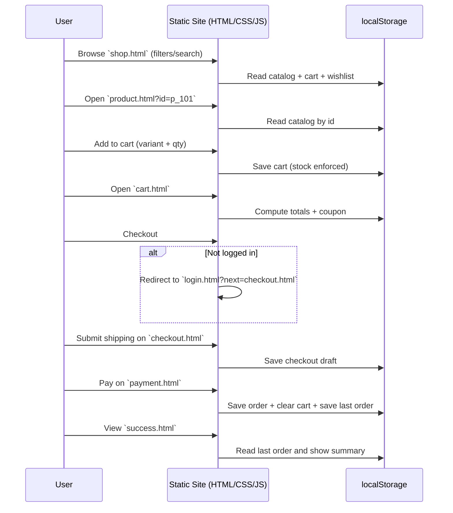

## GlowCare Frontend Architecture (Static)

```mermaid
flowchart TB
  subgraph Pages["Pages (Static HTML)"]
    I[index.html]
    S[shop.html]
    P[product.html?id=...]
    W[wishlist.html]
    C[cart.html]
    CHK[checkout.html (shipping)]
    PAY[payment.html]
    OK[success.html]
    L[login.html]
    SU[signup.html]
    F[forgot.html]
    A[account.html]
    AD[admin.html]
    AB[about.html]
    CT[contact.html]
    INF[info.html]
  end

  subgraph Components["Reusable Components (Injected)"]
    NAV[components/navbar.html]
    FTR[components/footer.html]
  end

  subgraph CSS["CSS Layers"]
    BASE[css/style.css]
    NAVCSS[css/navbar.css]
    RESP[css/responsive.css]
    ANIMCSS[css/animations.css]
    HCSS[css/homepage.css]
    SHCSS[css/shop.css]
    PCSS[css/product.css]
    CCSS[css/cart.css]
    CHKCSS[css/checkout.css]
    PAYCSS[css/payment.css]
    SCSS[css/success.css]
    LCSS[css/login.css]
    ACCSS[css/account.css]
    ADCSS[css/admin.css]
    ICSS[css/info-pages.css]
  end

  subgraph JS["JS Modules (Vanilla Scripts)"]
    MAIN[js/main.js]
    ANIM[js/animations.js]
    HOME[js/homepage.js]
    SHOP[js/shop.js]
    PROD[js/product.js]
    CART[js/cart.js]
    CHECK[js/checkout.js]
    PAYJS[js/payment.js]
    SUC[js/success.js]
    WISH[js/wishlist.js]
    LOGIN[js/login.js]
    SIGN[js/signup.js]
    FORG[js/forgot.js]
    ACC[js/account.js]
    ADMIN[js/admin.js]
    CONTACT[js/contact.js]
  end

  Pages --> MAIN
  Pages --> NAV
  Pages --> FTR
  MAIN -->|injects| NAV
  MAIN -->|injects| FTR

  I --> HOME
  S --> SHOP
  P --> PROD
  W --> WISH
  C --> CART
  CHK --> CHECK
  PAY --> PAYJS
  OK --> SUC
  L --> LOGIN
  SU --> SIGN
  F --> FORG
  A --> ACC
  AD --> ADMIN
  CT --> CONTACT
```

## Commerce Flow (Frontend-only)



